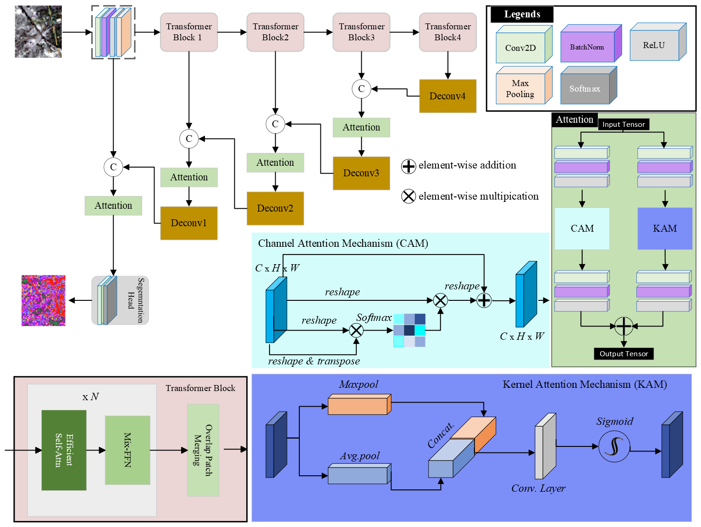
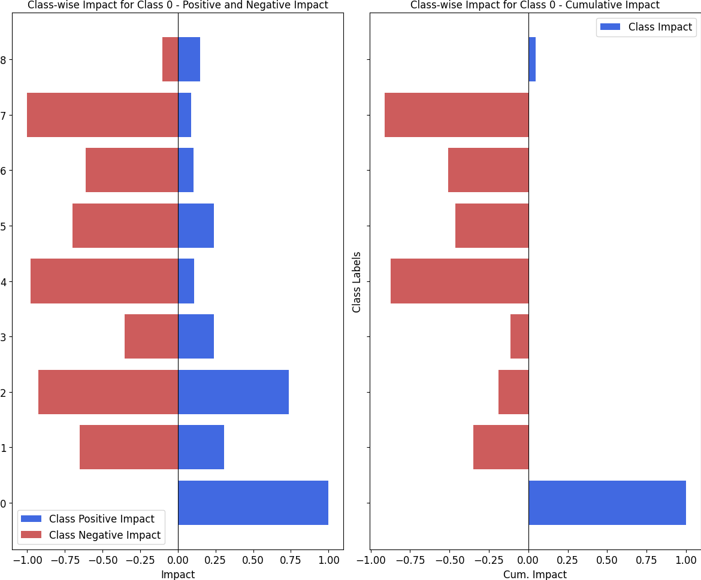
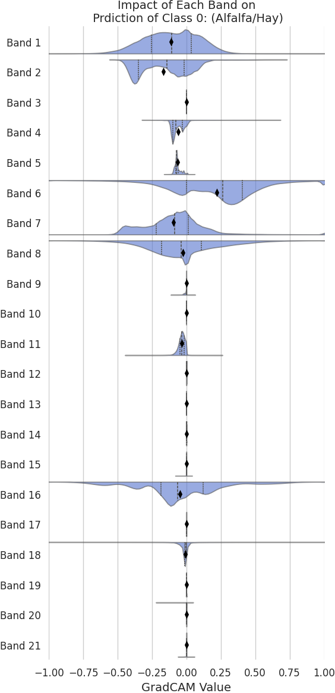
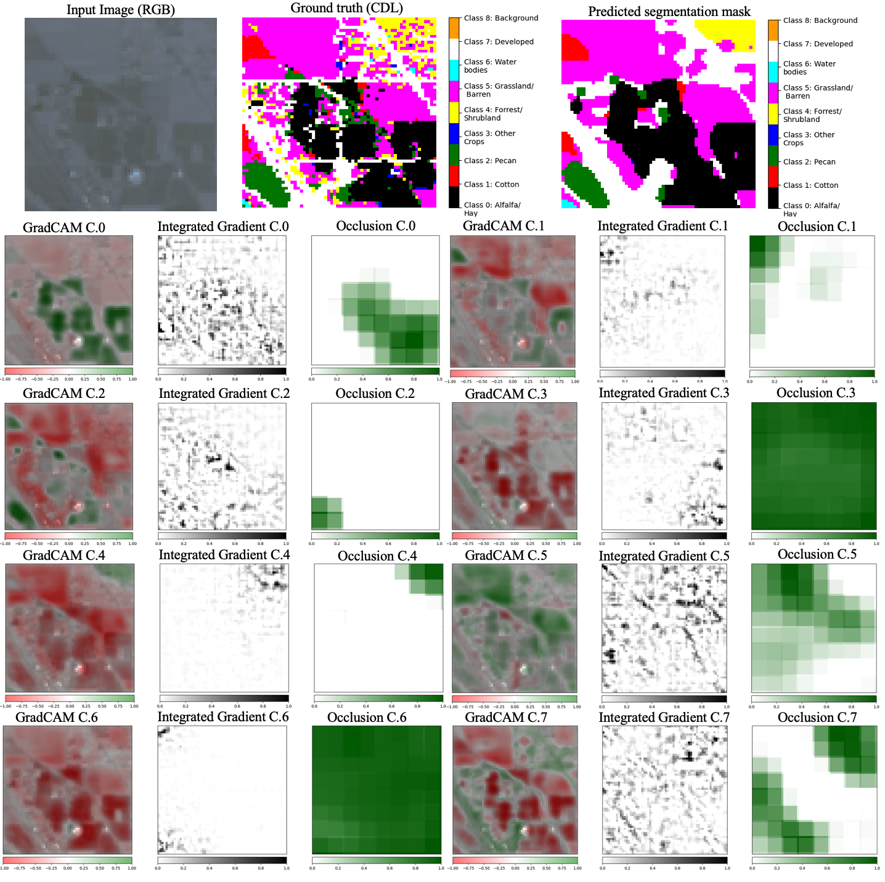

# [What Helps to Detect What? Explainable AI and Multisensor Fusion for Semantic Segmentation of Simultaneous Crop and Land Cover Land Use Delineation]

- [link to the Paper](https://ieeexplore.ieee.org/abstract/document/10849589)
### Abstract
This study introduces two novel explainable AI frameworks, Interclass-Grad-CAM and Spectral-Grad-CAM, designed to enhance the interpretability of semantic segmentation models for Crop and Land Cover Land Use (CLCLU) mapping. Interclass-Grad-CAM provides insights into interactions between land cover classes, revealing complex spatial arrangements, while Spectral-Grad-CAM quantifies the contributions of individual spectral bands to model predictions, optimizing spectral data use. These XAI methods significantly advance understanding of model behavior, particularly in heterogeneous landscapes, and ensure enhanced transparency in CLCLU mapping. To demonstrate the effectiveness of these innovations, we developed a framework that addresses data asymmetry between the United States and Mexico in the transboundary Middle Rio Grande region. Our approach integrates pixel-level multisensor fusion, combining dual-month moderate-resolution optical imagery (July and December 2023), synthetic aperture radar (SAR), and digital elevation model (DEM) data, processed using a Multi-Attention Network with a modified Mix Vision Transformer encoder to process multiple spectral inputs. Results indicate a uniform improvement in class-specific Intersection over Union by approximately 1% with multisensor integration compared to optical imagery alone. Optical bands proved most effective for crop classification, while SAR and DEM data enhanced predictions for nonagricultural types. This framework not only improves CLCLU mapping accuracy, but also offers a robust tool for broader environmental monitoring and resource management applications.
## Citation
If you use this code, please cite:\
**"S. Ebrahimi and S. Kumar, "What Helps to Detect What? Explainable AI and Multisensor Fusion for Semantic Segmentation of Simultaneous Crop and Land Cover Land Use Delineation," in IEEE Journal of Selected Topics in Applied Earth Observations and Remote Sensing, vol. 18, pp. 5423-5444, 2025, doi: 10.1109/JSTARS.2025.3532829."**

### Model
- **modeling_MANET.py**: Script for training the MANet model on the fused data.
- **model_inference_MANET.py**: Script for validating/testing the trained MANet model.
- **Customized_mixed_vision_transformer**: Contains the customized MiT-B5 architecture adapted for this project.\
  
**Figure 1.** MANET-MiTB5.
### Interclass GradCAM

1. **Computation**  
   After training the model, run `Interclass_GadCAM.py` to generate GradCAM-based interpretability maps for all classes in the dataset. The script compiles these maps into a dictionary called `all_gradcam_analysis` and saves it in the `gradcam_results` subdirectory in JSON format.

2. **Visualization**  
   To visualize the computed interclass GradCAM maps, run `plot_InterClass_GradCAM.py`. This module reads the JSON data from the `gradcam_results` directory and produces the corresponding plots.\
   
**Figure 2.** InterClass GradCAM for class 0.

---

### Spectral GradCAM

To perform spectral-based GradCAM analysis, run `Spectral_GradCAM.py`. This script processes the trained model’s outputs and saves the resulting plots in the `gradcam_results` subdirectory.\
   \
**Figure 3.** Spectral GradCAM for band 0.

### Occlusion-Based Integrated Grad-CAM

Running `Occ_INTEG_Grad.py` plots the occlusion, Integrated Gradients, and GradCAM values for a single input instance, providing a detailed visualization of how each method highlights important regions of the input image.
   \

## Acknowledgments

This work builds upon and extends existing research and codebases from various open-source projects. We gratefully acknowledge the following repositories:

- [segmentation_models.pytorch](https://github.com/qubvel-org/segmentation_models.pytorch)
- [SegFormer](https://github.com/NVlabs/SegFormer)
- [HRNet-Semantic-Segmentation](https://github.com/HRNet/HRNet-Semantic-Segmentation)

We thank the respective authors and maintainers for their contributions to the open-source community.

